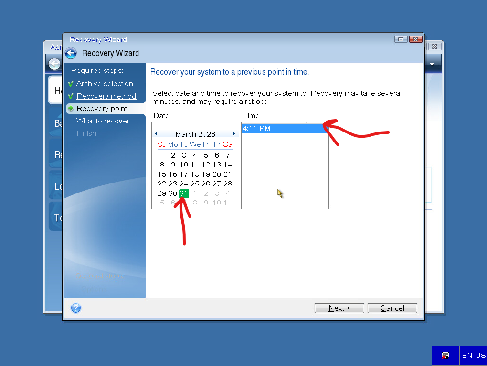

# 🖥️ Acronis Disk Management Guide (Backup · Restore · Clone · Tools)

## 📑 Índice

1. [Introducción y punto de partida](#-1-introducción-y-punto-de-partida)  
2. [Proceso de backup (copia de seguridad)](#-2-proceso-de-backup-copia-de-seguridad)  
3. [Evidencia del backup generado](#-3-evidencia-del-backup-generado)  
4. [Restauración del sistema](#-4-restauración-del-sistema)  
5. [Clonado de disco](#-5-clonado-de-disco)  
6. [Herramientas adicionales: borrado seguro](#-6-herramientas-adicionales-borrado-seguro)  
7. [Notas importantes](#-7-notas-importantes)  
8. [Aviso legal / responsabilidad](#-8-aviso-legal--responsabilidad)  

---

## 📌 1. Introducción y punto de partida

En esta guía se documenta el uso de **Acronis True Image** para realizar:

- Backup completo del sistema  
- Restauración  
- Clonado de discos  
- Borrado seguro de datos  

Todo el proceso se ha realizado mediante **USB booteable de Acronis**, trabajando fuera del sistema operativo.

### 🔧 Requisitos

- USB booteable con Acronis  
- Disco origen (sistema)  
- Disco destino (backup o clon)  

---

### 🖼️ Estado inicial

Se observa:
- Disco principal con sistema (C:)  
- Particiones EFI y Recovery  
- Disco secundario para almacenamiento  

---

### 🚀 Arranque desde USB

Seleccionamos:

Acronis True Image (64-bit)

---

## 💾 2. Proceso de backup (copia de seguridad)

### Acceso

Seleccionamos:
- **Backup → My Disks**

---

### Selección de particiones

Seleccionamos:
- EFI  
- C:  
- Recovery  

✔️ Fundamental para que el sistema sea arrancable  

---

### Ubicación del backup

---

### Ruta del archivo

Ejemplo:
E:\Micopia.tibx

---

### Confirmación

---

### Resumen

---

### Ejecución

---

## 📂 3. Evidencia del backup generado

El archivo `.tibx` contiene la copia completa del sistema.

---

## 🔄 4. Restauración del sistema

### Acceso

---

### Selección del backup

---

### Método

Seleccionamos:
- Recover whole disks and partitions  

---

### Punto de restauración

---

### Selección de contenido

---

### Disco destino

⚠️ Este proceso sobrescribe completamente el disco  

---

## 🔁 5. Clonado de disco

### Acceso a herramienta

---

### Disco origen

---

### Disco destino

---

### Método de clonado

Opciones:
- Reemplazar disco (misma máquina)  
- Uso en otro equipo  
- Disco de datos  

---

### Resumen

---

## 🧹 6. Herramientas adicionales: borrado seguro

---

### Selección de disco

---

### Algoritmos

#### Métodos principales:

- **DoD 5220.22-M** → estándar militar, alta seguridad  
- **Gutmann** → máximo nivel (muy lento)  
- **Schneier** → equilibrio seguridad/rendimiento  
- **GOST** → estándar ruso  
- **VSITR** → estándar alemán  
- **Fast** → borrado rápido (menos seguro)  

✔️ Ideal para eliminación de datos sensibles  

---

## 🧠 7. Notas importantes

- No interrumpir procesos  
- Verificar discos antes de ejecutar  
- Backup, restore y clone sobrescriben datos  
- Incluir siempre EFI + Recovery  
- SSD mejora el rendimiento  

---

## ⚖️ 8. Aviso legal / responsabilidad

Este procedimiento ha sido realizado con una **licencia oficial de Acronis True Image**.

Esta guía tiene fines **educativos y técnicos**.

⚠️ El uso incorrecto de estas herramientas puede provocar:
- Pérdida de datos  
- Sobrescritura de discos  
- Daños en sistemas  

El autor **no se hace responsable** del uso indebido de la información aquí descrita.

Se recomienda realizar pruebas en entornos controlados antes de aplicarlo en producción.

---

## 📦 Resultado final

Con este proceso se consigue:

- Backup completo del sistema  
- Restauración funcional  
- Clonado de discos  
- Eliminación segura de datos  

Todo ello utilizando Acronis desde entorno booteable.
